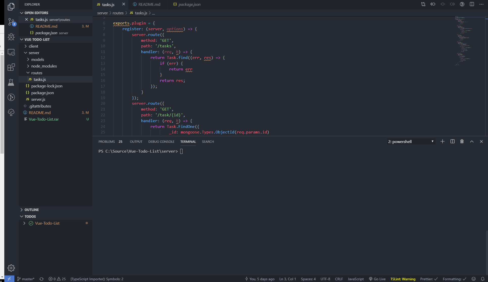
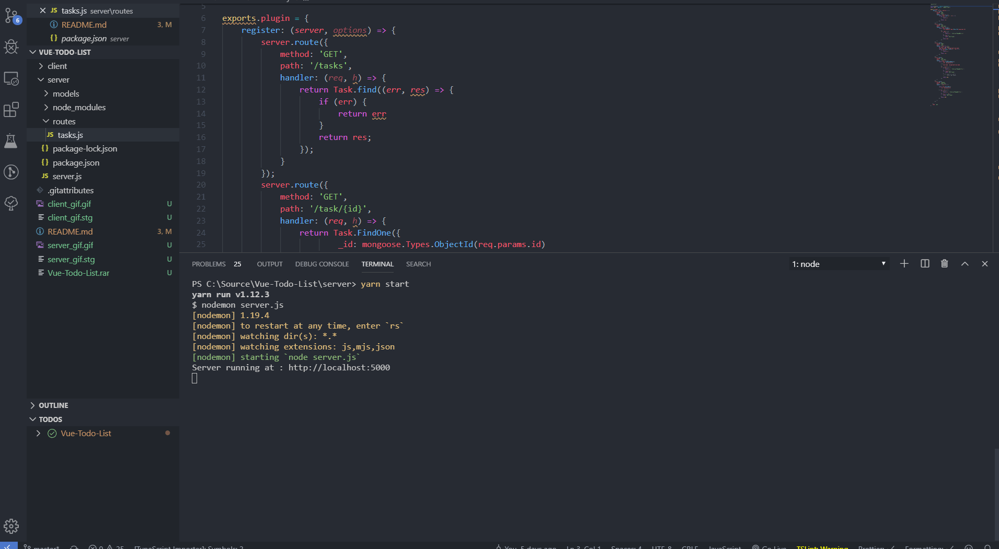

## Todo_List

## Server DEMO

## WEBAPP DEMO

## Basic instalation steps:

`navigate to server folder`

`run 'yarn start' in terminal`

`open new terminal`

`navigate to the client folder`

`run yarn serve in terminal`
